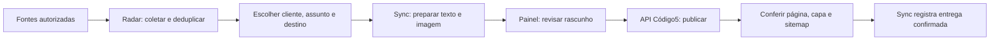

# Blog Código5 + Radar + Sync

Plano de expansão e diagnóstico — 09/09/2026.

## 1. Decisão e resultado esperado

Manter o site atual e o painel editorial. Usar o Radar para descobrir e organizar referências; o Sync para preparar texto e imagem; o painel para revisar; e a API do site para publicar. Não migrar o site inteiro para WordPress nem dar ao Sync acesso direto ao banco da Código5.

Primeira entrega da integração: uma fonte monitorada para a Código5 gera uma pauta, que vira rascunho com imagem, é revisada e publicada uma única vez no blog. Depois, repetir o cadastro para outros clientes e destinos, sem alterar os portais existentes.

## 2. O que existe hoje

| Parte | Situação confirmada |
|---|---|
| Páginas institucionais | Conteúdo em `src/content/company.ts`, `siteContent.ts` e componentes. Gerado no build; alterações exigem publicação do site. O painel não edita serviços, história e portfólio. |
| Blog | Híbrido. Acervo empacotado em `src/content/blog-posts.json` e posts dinâmicos em SQLite no Mac Mini. O navegador combina os dois por slug; alterações dinâmicas podem substituir a versão do acervo. |
| HTML e SEO | `functions/_middleware.ts` consulta posts dinâmicos para responder com conteúdo, título, imagem e schema no HTML. Sitemap inclui conteúdo dinâmico. Não é apenas conteúdo inserido por JavaScript. |
| Painel | `/admin/editorial`: acesso protegido por Telegram/link de acesso; criação, importação do acervo, edição visual, capa, geração de texto, publicação e arquivamento. |
| API | `/api/admin/posts*` para usuário autenticado; `/api/bot/*` para fluxo do bot; `/api/bot/posts` para leitura pública. Nenhuma destas deve virar uma escrita pública sem autenticação. |
| Imagens | Upload e armazenamento no Spaces, já usados pelo editor. |
| Radar | Projeto local `RadarCred`, SQLite e catálogo/adapters de fontes; container `radarcred` ativo no Mac Mini. Revisão exata da imagem não identificável por tag atual. |
| Sync | Produção verificada no Mac Mini/Portainer: `cod5-sync-app`, imagem `sha-5bcde48` na auditoria inicial (referência histórica; conferir release atual antes de implementar), com backup e watchdog. Node executa `server.mjs`; SQLite local emula interface D1 e fila durável. A pasta `worker` não significa que a produção está em Cloudflare. |
| Integração existente | Radar cria candidatos em modo `simulate`; Sync recebe em `/v1/admin/radarcred/candidates` e processa pela fila. Publicação atual usa adapter WordPress. Não foi encontrado adapter para o blog Código5. |

### Pré-requisito resolvido pela migração

O limite D1 observado na auditoria inicial foi superado pela migração do Código5 para SQLite no Mac Mini, release c93deaa. Banco, sessões, criação/edição de rascunho e upload foram validados pela API pública; publicação e SEO dinâmico foram testados em banco temporário. Não houve publicação fictícia em produção. Operação e recuperação: [runbook](migracao-macmini-operacao.md).

A primeira publicação real da integração continua sendo um critério de aceite, com conteúdo aprovado para o blog. A integração Radar → Sync → Código5 ainda não está implementada.

### Melhorias imediatas do painel

- Separar título, resumo, texto e imagem dos ajustes opcionais de fonte, endereço e busca.
- Usar nomes simples no lugar de “cockpit”, “CRUD”, “slug” e “preview”.
- Salvar os campos atuais antes de publicar, gerar texto ou enviar capa; não executar a próxima etapa se o salvamento falhar.
- Manter o editor aberto após salvar e conservar o texto diante de erro.
- Avisar quando a lista do banco não carregar, em vez de aparentar uma listagem dinâmica completa.

Limite preservado: o salvamento atual de um artigo já publicado também atualiza sua versão pública. Uma revisão separada, com botão de aprovar alterações antes de torná-las públicas, exige versionamento e entra como evolução posterior. Não confundir “salvar publicado” com rascunho privado.

## 3. Fluxo proposto

Uma fonte pode interessar a mais de um cliente. Coletar o material uma vez e decidir o aproveitamento por cliente. Texto, identidade visual, regras e aprovação pertencem ao destino, não à fonte.

## 4. Fase 0 — capacidade e publicação manual confiável

1. Revalidar o SQLite e o release atual do Código5. A migração já foi concluída; não reabrir D1 nem criar banco compartilhado com Sync.
2. Medir consultas de listagem, artigo, sitemap e painel: frequência, linhas lidas, índice utilizado e volume retornado. O blog público deve buscar apenas posts publicados e a lista não precisa transportar o corpo integral de todos os artigos.
3. Manter a leitura pública atual sem cache de conteúdo dinâmico no piloto. Introduzir cache curto apenas se medições mostrarem necessidade, com invalidação após salvar/publicar/arquivar. Não aplicar cache a sessão, rascunhos ou conteúdo administrativo. Prever atualização entre regiões e tempo máximo de propagação; validar o conteúdo público após esse intervalo, sem interpretar um HTTP 200 como entrega.
4. Conferir estado de erro/fallback: artigo de acervo pode continuar disponível; artigo novo não deve virar um falso 404 permanente quando o banco estiver indisponível. Falhas temporárias não devem receber cache longo.
5. Validar pelo painel um artigo autorizado: criar, salvar, recarregar, adicionar capa, publicar e confirmar página, HTML, listagem e sitemap. Para testes, usar ambiente isolado; não publicar pauta fictícia em produção.

**Saída:** banco operacional, publicação manual confirmada e consumo de leitura conhecido. Sem isso, não iniciar automação recorrente.

## 5. Fase 1 — cadastro de clientes, destinos e fontes no Radar

Reaproveitar `source_catalog`, `sources`, `site_adapters`, `source_fetches`, `items` e `client_sources`.

### Cadastro de destino

Identificador estável do cliente/portal, nome, URL pública, tipo de publicação (`wordpress` ou `codigo5`), fuso, categorias válidas, contato responsável e estado ativo/pausado. Credenciais ficam no ambiente/gerenciador de segredos, nunca no CSV, tela pública ou documento.

### Cadastro de fonte

Domínio e URL canônica, forma de coleta (feed, HTML, sitemap ou URLs-semente), temas, idioma, frequência, prioridade, último sucesso e erro observado. Validar domínio e extração antes de ativar. Definir direitos e regras de aproveitamento; encontrar uma referência não autoriza copiar integralmente texto ou fotografia.

### Vínculo cliente × fonte

Reutilizar a unicidade do par existente. Associar relevância, assuntos incluídos/excluídos, região e limite de pautas. A mesma fonte pode ter vínculos diferentes para Código5, uma clínica ou uma loja.

### Operação de cadastro

“Adicionar fonte” → informar endereço → testar títulos, datas, links e texto → escolher clientes interessados → salvar desativada → ativar após teste. Fonte com falha de extração deve mostrar o motivo, não entrar silenciosamente na rotina.

O catálogo local auditado contém 237 fontes ativas e 24 vínculos ativos para `perrengue`. São contagens do cadastro consultado, não garantia de coleta bem-sucedida. Não transformar o grupo G5 em lista genérica: seu runner exige cinco domínios específicos. As sete linhas rotuladas G5 no catálogo mestre precisam de classificação; não provam falha do runner ativo. Criar grupos próprios para novos interesses, preservando o contrato G5.

**Saída:** fonte nova coletada e vinculada ao cliente certo; teste comprova que o vínculo de outro cliente não é alterado.

## 6. Fase 2 — seleção editorial por destino

1. Reaproveitar o envio de candidatos do Radar em `simulate`, sem publicar ao coletar.
2. Selecionar destino e categoria pela lista de opções reais do Sync; bloquear categoria inválida ou destino pausado.
3. Acrescentar perfil editorial por destino: público, serviço relacionado, tom, região, tamanho, instruções de imagem e necessidade de revisão. Para Código5: explicar implicações práticas para empresários, evitando notícia genérica sem relação com os serviços/clientes.
4. Manter referência original, data de coleta, hash e trecho utilizado. Informar ausência de dado; não completar fatos por suposição.
5. Preservar a política source-only do Sync. Adicionar fontes não autoriza ativar enriquecimento factual externo nem mudar regras dos portais atuais.

**Saída:** uma referência produz rascunhos distintos e corretamente associados a dois clientes, sem vazamento de regras ou reaproveitamento acidental de publicação.

## 7. Fase 3 — novo adapter de publicação Código5

O Sync já possui criação/atualização WordPress, busca por origem e `portal_publications`. Reaproveitar essa responsabilidade e adicionar o destino Código5 na mesma seleção de adapter, sem duplicar geração ou fila.

### API do site — contrato novo, ainda não implementado

Rotas propostas, não existentes: `POST /api/integrations/sync/articles`, `GET /api/integrations/sync/articles/:externalId` e ação autenticada de publicação. Separar criação/atualização de rascunho da publicação; o padrão inicial é rascunho.

Campos mínimos do contrato:

- `externalId`, `destinationId`, `revision` e chave de idempotência;
- título, endereço sugerido, resumo, conteúdo e termos validados;
- referências de origem e identificação do job/candidato;
- capa com descrição alternativa, origem e indicação de ilustração;
- ação solicitada: rascunho ou publicação autorizada.

Resposta deve conter identificador persistido, estado, revisão, URL canônica quando aplicável e erros legíveis. “Aceito” não significa “publicado”. Após timeout, consultar o mesmo identificador antes de reenviar.

### Segurança e consistência

- Credencial exclusiva por destino, revogável e com permissões separadas para rascunho/publicação. Não reutilizar a sessão do usuário nem distribuir o segredo administrativo geral entre clientes.
- Validar tamanho, HTML, categorias, URL, mídia e tipo de arquivo. Para baixar imagem, bloquear rede privada, redirects inseguros e formatos não permitidos; preferir upload para o armazenamento já usado pelo site.
- Índice único por integração + destino + identificador externo. Não usar só o slug para decidir se o conteúdo já existe.
- Registrar mapeamento para draft/post e revisão. Um retry não cria outro artigo; uma versão antiga não sobrescreve a mais nova.
- Preparar mídia antes de publicar. Se o upload falhar, manter o rascunho e o erro; não publicar artigo parcialmente pronto.
- Persistir mudanças relacionadas em transação/batch adequado. Preservar redirects em troca de endereço e impedir colisão com outro artigo.
- Gravar pela camada de conteúdo do site. O Sync não acessa SQLite diretamente; isso preserva regras, sanitização, SEO e auditoria.

**Saída:** enviar o mesmo job duas vezes gera um único rascunho, com a mesma capa e identificador. Revisão/publicação confirmadas pelo site e pelo Sync.

## 8. Fase 4 — experiência simples no painel

Tela de uso diário: “Pautas recebidas”, “Rascunhos” e “Publicados”. Em cada pauta: assunto, fonte, cliente/destino, data e botão “Preparar artigo”. No editor: título, texto, capa e “Salvar e publicar”; fonte e ajustes opcionais ficam acessíveis sem ocupar a tela inteira.

Exibir claramente:

- de onde veio a referência;
- quem deve revisar e para qual site o artigo irá;
- texto/imagem ainda em preparação, falha recuperável ou pronto para revisar;
- URL publicada somente depois da confirmação;
- último erro e próxima ação, sem exigir que o operador leia logs.

Sugestões de categoria/SEO podem ser automáticas, mas editáveis. Prévia deve mostrar título, resumo, capa e corpo como aparecerão no blog. Agendamento futuro só entra após o fluxo manual e a fila estarem validados; não criar um segundo agendador concorrente.

## 9. Fase 5 — canário e expansão

1. Começar com Código5, uma fonte escolhida e apenas rascunhos.
2. Confirmar coleta, deduplicação, geração, mídia, revisão e publicação na ordem.
3. Testar falhas: fonte fora do ar; resposta 429/500; imagem recusada; timeout após gravação; categoria inválida; colisão de endereço; replay; credencial revogada; banco sem capacidade.
4. Testar o mesmo material em dois destinos. Bloqueio de um destino não deve interromper outro, nem compartilhar credenciais.
5. Liberar gradualmente novos grupos e fontes. Definir orçamento/limites de gerações por destino, frequência e número de pautas; coleta e geração devem ter controles separados para evitar custo por item irrelevante.
6. Monitorar fila, jobs sem progresso, falhas por fonte, artigos duplicados e confirmação pública. Reutilizar lease/reclaim/watchdog e deduplicação do Sync; não criar outro sistema de filas.

**Concluído quando:** novo cliente/portal é cadastrado sem patch específico; uma publicação única e correta é confirmada; erro e retomada funcionam; portais atuais continuam com configuração e comportamento anteriores.

## 10. Ordem de execução e isolamento

| Ordem | Entrega | Dependência |
|---|---|---|
| 0 | Revalidar base já migrada e fluxo editorial | SQLite operacional; primeira publicação real ainda será conferida |
| 1 | Cadastro e teste de fontes/vínculos | Radar atual, sem mudar G5 |
| 2 | Perfil editorial por destino e candidatos | Categorias/destinos reais do Sync |
| 3 | API Código5 + adapter Sync + idempotência | Contrato versionado e testes isolados |
| 4 | Caixa de pautas/revisão no painel | API/candidatos funcionando |
| 5 | Canário e expansão gradual | Readback público e falhas testadas |

O Sync local estava com alterações alheias no worktree. Trabalhar em checkout isolado a partir da revisão de produção confirmada e reconciliar os contratos antes de mexer. README/SYSTEM do Sync ainda contêm referências Cloudflare incompatíveis com o runtime Node observado; corrigir a documentação no projeto antes da implementação. Não usar caminhos de infraestrutura legada como base do rollout.

Rollback por etapa: pausar apenas o destino Código5, preservar jobs e artefatos, restaurar a imagem/deployment anterior, manter migrações aditivas e não apagar artigos entregues. Não restaurar banco inteiro para desfazer uma alteração de interface.

## 11. Evidências e pontos de entrada

Código5: `src/hooks/use-runtime-blog.ts`, `src/pages/AdminEditorialPage.tsx`, `functions/api/admin/posts-save.ts`, `posts-publish.ts`, `functions/api/bot/posts.ts`, `functions/_shared/bot/db.ts`, `functions/_middleware.ts` e `wrangler.toml`.

Radar: `src/radarcred/sources.py`, `crawler.py`, `runner.py`, `storage.py`, `web.py`, `data/source_catalog.csv`, `data/client_sources.csv` e `docs/source-sync-spec.md`.

Sync: `docs/contracts/v1-api.md`, `db/schema.sql`, `worker/src/index.ts`; produção inspecionada em `server.mjs`, funções `Cod5SqliteD1`, `Cod5DurableQueue`, `createOrUpdateWordPressPost`, `processQueuedJob` e `findExistingWordPressPostByOrigin`. A equivalência do checkout local com a imagem ativa não foi assumida.

Este documento é um plano. Não foram cadastradas fontes, ativados jobs, implementado o novo adapter ou publicadas pautas em nome do usuário.

## 12. Recorte executável após a migração

Atualização de planejamento: 09/09/2026. Este pedido autoriza o planejamento; não ativa coleta, geração paga nem publicação automática.

### Perfil inicial Código5

Objetivo: transformar referências em conteúdo útil para empresários sobre atendimento, vendas, presença digital e organização do trabalho. Não produzir um espelho de notícias de tecnologia.

Grupos iniciais: atendimento e agenda (clínicas, barbearias e oficinas); comércio e vendas digitais; sites e descoberta nas buscas; conteúdo e operação de portais. Cada pauta deve indicar público e utilidade concreta. Exemplos de perguntas editoriais: “O que muda para quem atende pelo WhatsApp?” e “Como essa mudança afeta a loja?”. Não inventar resultados de clientes ou funcionalidades.

Começar com até cinco fontes de um único grupo. Escolher e testar URLs reais antes do cadastro: feed/extração, data, autoria, origem e permissão de aproveitamento. Este plano não presume uma lista de domínios aprovada. Expandir após avaliar relevância, duplicidade e custo do piloto.

### Sequência de entregas

| Etapa | Alteração | Prova de aceite |
|---|---|---|
| 1 | Fixar contrato de artigo e identificador externo no site; credencial restrita à integração | Sem credencial não grava; repetição e timeout não duplicam; revisão antiga não sobrescreve edição humana |
| 2 | Criar adapter Código5 no Sync usando a geração, mídia e fila existentes | Um job gera um rascunho persistido no site; falha de imagem não publica; WordPress continua passando nos testes |
| 3 | Configurar destino e perfil editorial Código5; cadastrar e testar uma fonte no Radar | Candidato chega ao destino correto com referência, data e identificador rastreáveis |
| 4 | Revisar texto e capa no painel já existente | Operador abre, edita e salva sem perder alterações; fonte e destino visíveis |
| 5 | Publicar o primeiro artigo real aprovado | Página, capa, HTML SEO, listagem e sitemap corretos; Sync confirma URL e estado persistidos |
| 6 | Habilitar coleta recorrente e ampliar até cinco fontes | Rodada seguinte completa sem duplicação; pausa e retomada funcionam; custo e erros registrados |

A ordem prioriza um caminho completo com uma fonte antes de ampliar telas ou catálogos. Melhorias gerais de cadastro e uma caixa nova de pautas entram só quando o fluxo atual não atender o piloto.

### Controles do piloto

Proposta inicial: coleta duas vezes ao dia, até três candidatos por rodada e no máximo um rascunho gerado por dia. São limites propostos, não configurações já aplicadas. Separar limite de coleta do limite de geração; não consumir IA por cada item encontrado. Reutilizar o provedor configurado no Sync, registrar consumo disponível e manter revisão humana antes da publicação. Publicação totalmente automática exige uma etapa posterior explícita de ativação e critérios editoriais consolidados.

Em falha após envio, consultar o artigo pelo mesmo identificador; não reenviar cegamente. Se o editor humano alterar o rascunho, impedir que retry do Sync sobrescreva essa alteração. Uma pauta pode servir a dois clientes, mas cada publicação tem estado, texto e credencial próprios.

### Isolamento e retorno

Antes de implementar, conferir AGENTS locais, git status, revisão ativa e trabalho concorrente dos três projetos. Criar isolamento por repositório. Alterações de contrato precedem adapter; integração e publicação ocorrem em série. Pausar apenas o destino Código5 em caso de falha, mantendo novos dados e artigos já publicados. Não alterar o G5 ou a rotina dos portais existentes.
